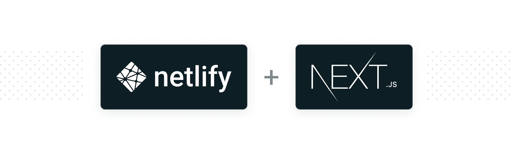

<p align="center">
  <a aria-label="npm version" href="https://www.npmjs.com/package/next-on-netlify">
    
  </a>
  <a aria-label="MIT License" href="https://img.shields.io/npm/l/next-on-netlify">
    
  </a>
  <a aria-label="npm downloads" href="https://www.npmjs.com/package/next-on-netlify">
    
  </a>
  <a aria-label="Tested with Cypress" href="https://www.cypress.io/">
    
  </a>
</p>

`next-on-netlify` is a utility for enabling server-side rendering in Next.js on Netlify. It wraps your application in a tiny compatibility layer, so that pages can use Netlify Functions to be server-side rendered.

- Build plugin [@netlify/plugin-nextjs](https://github.com/netlify/netlify-plugin-nextjs)
- [Plugin npm package](https://www.npmjs.com/package/@netlify/plugin-nextjs)

## Next on Netlify Roadmap

The future of Next.js on Netlify is growing beyond `next-on-netlify`. The recommended path forward is to install [@netlify/plugin-nextjs](https://github.com/netlify/netlify-plugin-nextjs) - a build plugin released and supported by the team behind `next-on-netlify`.

The plugin relies on `next-on-netlify` but offers a smoother experience, including:

1. one-click, zero-config installation
2. allowing custom functions and publish directories

See the [plugin's README](https://github.com/netlify/netlify-plugin-nextjs#readme) for more information. Our team's end goal is to make the Next.js on Netlify experience as seamless as possible.

Note: since `next-on-netlify` will remain the primary source of logic for Next.js on Netlify, the existing `next-on-netlify` setup will continue to work for users who prefer manual installation and configuration.

The plugin can be found on [npm here](https://www.npmjs.com/package/@netlify/plugin-nextjs).

## Table of Contents

- [Installation](#installation)
- [Setup](#setup)
  - [1. Set Next.js target to serverless](#1-set-nextjs-target-to-serverless)
  - [2. Add postbuild hook](#2-add-postbuild-hook)
  - [3. Configure for Netlify](#3-configure-for-netlify)
    - [(Optional) Configure private git submodules](#optional-configure-private-git-submodules)
- [Demo](#demo)
- [Optional Extras](#optional-extras)
  - [Preview Locally](#preview-locally)
  - [Custom Netlify Redirects](#custom-netlify-redirects)
  - [Custom Netlify Functions](#custom-netlify-functions)
  - [Using Netlify Identity](#using-netlify-identity)
- [Caveats](#caveats)
  - [Fallbacks for Pages with `getStaticPaths`](#fallbacks-for-pages-with-getstaticpaths)
  - [next/image](#nextimage)
- [Credits](#credits)
- [Showcase](#showcase)


## Installation

```
npm install --save next-on-netlify
```

## Setup

### 1. Set Next.js target to serverless

We must build our Next.js app as a serverless app. You can read more about serverless Next.js [here](https://nextjs.org/docs/api-reference/next.config.js/build-target#serverless-target).

It's super simple. Just create a `next.config.js` file and write the following:

```js
// next.config.js

module.exports = {
  // Target must be serverless
  target: "serverless",
};
```

If binaries are needed in the deployment the following configuration is needed ([Prisma](https://github.com/prisma/prisma) is an example):

```js
// next.config.js

module.exports = {
  // Target must be experimental-serverless-trace
  // Your build time will be longer with this option
  target: "experimental-serverless-trace",
};
```

### 2. Add postbuild hook

The next-on-netlify package adds the `next-on-netlify` command. When we run this command, some magic happens to prepare our Next.js app for hosting on Netlify\*.

We want the next-on-netlify command to run after we build our Next.js application. So let's add a postbuild hook to our package.json file:

```
{
  "name": "my-nextjs-app",
  "scripts": {
    "dev": "next",
    "build": "next build",
    "postbuild": "next-on-netlify"
  },
  ...
}
```

\*If you're curious about the "magic", check out the well-documented [`next-on-netlify.js` file](https://github.com/netlify/next-on-netlify/blob/master/next-on-netlify.js).

### 3. Configure for Netlify

We're almost done! We just have to tell Netlify how to build our Next.js app, where the functions folder is located, and which folder to upload to its CDN. We do that with a `netlify.toml` file and the following instructions:

```toml
[build]
  command   = "npm run build"
  functions = "out_functions"
  publish   = "out_publish"
```

Note: `out_functions` and `out_publish` are hard-coded into next-on-netlify.
These are not configurable at the moment.

#### (Optional) Configure private git submodules
If your project contains private submodules, in order to deploy it, you will
need to:

1. [Generate a Deploy
   Key](https://docs.netlify.com/configure-builds/repo-permissions-linking/#deploy-keys)
   in Netlify and [add it to the relevant
   submodules](https://docs.github.com/en/developers/overview/managing-deploy-keys#setup-2)
   so that they can be cloned during the deploy process.

2. Ensure the submodule remotes are set to SSH format (i.e.
   `git@github.com:owner/project.git`, not `https://...`). Inside the submodule
   directory, the git remote can be updated with: 

   ```bash
   # git remote set-url [remote] [url]
   git remote set-url origin git@github.com:owner/project.git
   ```

We're done. Let's deploy 🚀🚀🚀

## Demo

- Site: https://next-on.netlify.com/
- Code: https://github.com/netlify-labs/next-on-netlify-demo

## Optional Extras

### Preview Locally

I recommend you still use `next dev` to build and preview your application locally.

But if you want to emulate the Netlify deployment on your computer, you can also run `next-on-netlify` locally and then use `netlify-cli` to preview the result.

First, install the latest version of `netlify-cli` (you can also [look at package.json](https://github.com/netlify/next-on-netlify/blob/master/package.json) to see the version that next-on-netlify has been tested against):

```bash
npm install -g netlify-cli
```

Then, add the following `[dev]` block to your `netlify.toml`:

```toml
# netlify.toml

# [build]
#   ...

[dev]
  functions = "out_functions"
  publish   = "out_publish"
  # We manually set the framework to static, otherwise Netlify automatically
  # detects Next.js and redirects do not work.
  # Read more: https://github.com/netlify/cli/blob/master/docs/netlify-dev.md#project-detection
  framework = "#static"
```

Lastly, add the following lines to your `.gitignore`:

```shell
# .gitignore

# Files generated by next-on-netlify command
/out_publish/
/out_functions/
```

Now you're all set.

From now on, whenever you want to preview your application locally, just run:

1. `npm run build`: This will run `next build` to build your Next.js app and `next-on-netlify` to prepare your Next.js app for compatibility with Netlify
1. `netlify dev`: This will emulate Netlify on your computer and let you preview your app on `http://localhost:8888`.

*Note:*

Preview Mode is not yet available locally, running `netlify dev`, for static pages without revalidate or fallback. This will be supported soon.

For now, Preview Mode *is* supported in production for all Next.js page types.

### Custom Netlify Redirects

You can define custom redirects in a `_redirects` and/or in your `netlify.toml` file.
The precedence of these rules are:

- `_redirects`
- `next-on-netlify` redirects

Currently, there is no support for redirects set in your `netlify.toml` file.

[Read more about Netlify redirects here](https://docs.netlify.com/routing/redirects/).

### Custom Netlify Functions

`next-on-netlify` creates one Netlify Function for each of your
SSR pages and API endpoints. It is currently not possible to create custom Netlify Functions. This feature is on our list to do.

### Using Netlify Identity

You can use [Netlify Identity](https://docs.netlify.com/visitor-access/identity/) with `next-on-netlify`. For all pages with server-side rendering (getInitialProps*, getServerSideProps, and API routes), you can access the [clientContext object](https://docs.netlify.com/functions/functions-and-identity/#access-identity-info-via-clientcontext) via the `req` parameter.

For example:

```js
const Page = () => <p>Hello World!</p>;

export const getServerSideProps = async ({ req }) => {
  // Get event and context from Netlify Function
  const {
    netlifyFunctionParams: { event, context },
  } = req;

  // Access Netlify identity
  const { identity, user } = context.clientContext;

  return {
    props: {},
  };
};

export default Page;
```

To access Netlify Identity from pages without server-side rendering, you can create a [Next API route](https://nextjs.org/docs/api-routes/introduction) that performs identity-related logic:

```js
export default async function getUser(req, res) {
  // Get event and context from Netlify Function
  const {
    netlifyFunctionParams: { event, context },
  } = req;

  // Access Netlify identity
  const { user } = context.clientContext;

  // Respond with user object
  res.json({ user });
}
```

\* Note that pages using getInitialProps are only server-side rendered on initial page load and not when the user navigates client-side between pages.


## Caveats

### Fallbacks for Pages with `getStaticPaths`

[Fallback pages](https://nextjs.org/docs/basic-features/data-fetching#fallback-true) behave differently with `next-on-netlify` than they do with Next.js. On Next.js, when navigating to a path that is not defined in `getStaticPaths`, it first displays the fallback page. Next.js then generates the HTML in the background and caches it for future requests.

With `next-on-netlify`, when navigating to a path that is not defined in `getStaticPaths`, it server-side renders the page and sends it directly to the user. The user never sees the fallback page. The page is not cached for future requests.

For more on this, see: [Issue #7](https://github.com/netlify/next-on-netlify/issues/7#issuecomment-636883539)

### next/image

Our existing solution for next/image is not very performant. We have performance improvements on our roadmap, dependent on internal work.

To get better performance now, we recommend using a cloud provider like Cloudinary ([see the Next.js docs](https://nextjs.org/docs/basic-features/image-optimization#loader)).

## Credits

This package is maintained by [Lindsay Levine](https://github.com/lindsaylevine), [Finn Woelm](https://github.com/FinnWoelm), and [Cassidy Williams](https://github.com/cassidoo).

📣 Shoutout to [@mottox2](https://github.com/mottox2) (a pioneer of hosting Next.js on Netlify) and [@danielcondemarin](https://github.com/danielcondemarin) (author of serverless-next.js for AWS). The two were big inspirations for this package.

🙌 Big "thank you" to the following people for their contributions, support, and beta testing:

- [@spencewood](https://github.com/spencewood)
- [@alxhghs](https://github.com/alxhghs)
- [@gamliela](https://github.com/gamliela)
- [@wei](https://github.com/wei)
- [@laugharn](https://github.com/laugharn)
- [@rajington](https://github.com/rajington)
- [@etrepum](https://github.com/etrepum)
- [@jonasbuntinx](https://github.com/jonasbuntinx)
- [@joostmeijles](https://github.com/joostmeijles)


## Showcase

The following sites are built with `next-on-netlify`:

  
[opinionatedreact.com](https://opinionatedreact.com/) ([via Twitter](https://twitter.com/NikkitaFTW/status/1302667952920162309))

  
[missionbit.org](https://www.missionbit.org/) ([#18](https://github.com/netlify/next-on-netlify/pull/18#issuecomment-643828966))


[gemini.com](https://gemini.com/)

[](https://netlify.jamify.org)

[Create your own blog and deploy to Netlify!](https://github.com/styxlab/next-cms-ghost)

Are you building something awesome with `next-on-netlify`? 🔥 Let us know and we will feature it here :)
